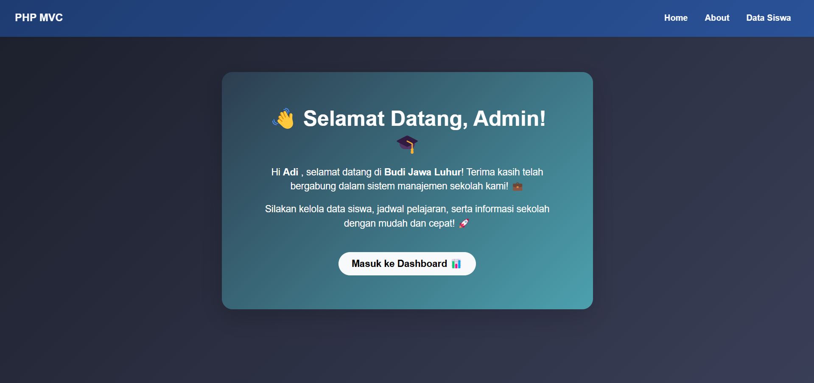
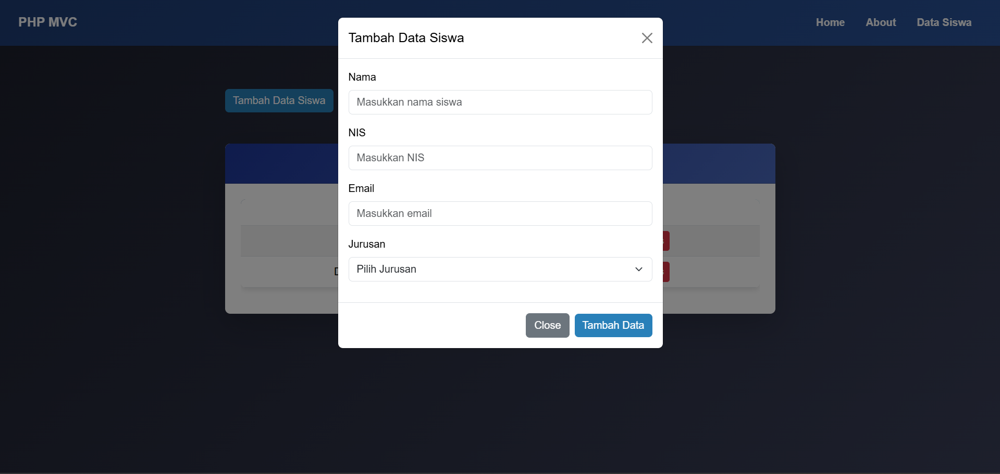
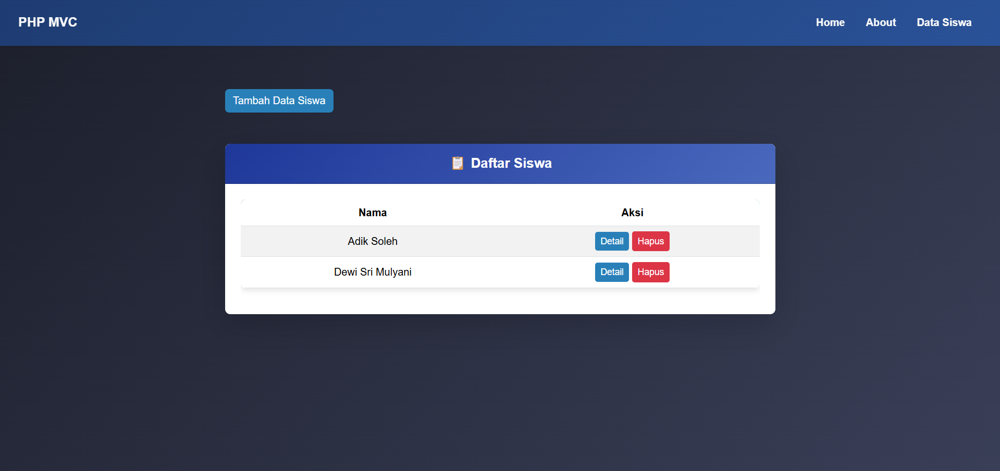
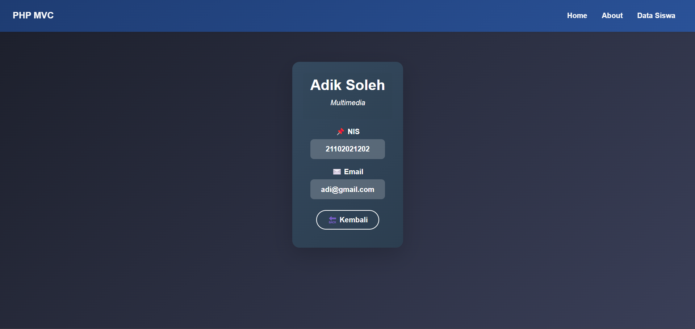
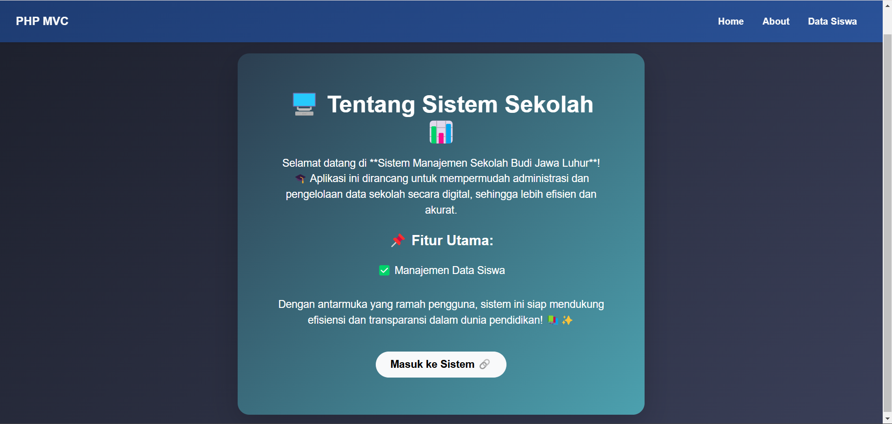
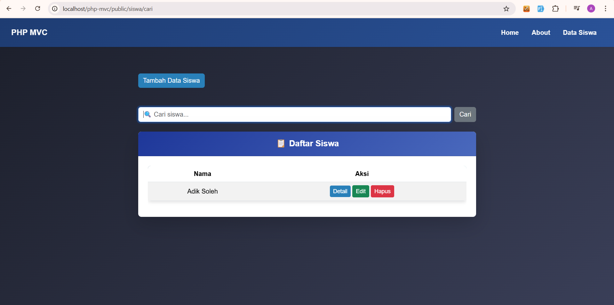
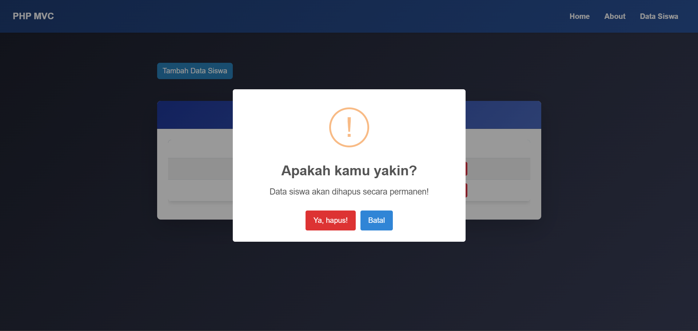

# **StudentSphere - Student Management System** 🎓📊  

**StudentSphere** is an **MVC-based** student management web application built with **PHP**, **AJAX**, **Bootstrap**, **HTML**, **CSS**, and **MySQL**. This project simplifies student data management by providing an intuitive interface and real-time interactions. 🚀  

---

## 📌 **Features**  
✅ **CRUD Operations** – Easily add, edit, delete, and view student details.  
✅ **Real-Time Search** – Find student records instantly using AJAX.  
✅ **Responsive Design** – Built with **Bootstrap** for mobile-friendly UI.  
✅ **Modal Forms** – Add & edit student data using **Bootstrap Modals**.  
✅ **Flash Messages** – Get instant feedback after performing actions.  
✅ **SweetAlert Integration** – Confirmation dialogs for better UX.  

---

## 🏗 **Tech Stack**  
🔹 **Backend:** PHP (MVC Architecture)  
🔹 **Frontend:** HTML, CSS, Bootstrap  
🔹 **Database:** MySQL  
🔹 **AJAX & jQuery:** For real-time data processing  


## 📸 **Screenshots**  

### 🏠 Home  
  

### 📝 Add Student Form  
  

### 📋 Student List  
  

### 🔍 Student Detail  
  

### ℹ️ About  
  

### 🔎 Search  
  

### 🗑️ Delete Student  
  


## 🚀 **Installation Guide**  
### 1️⃣ **Clone the Repository**  
```bash
git clone https://github.com/Adik-soleh/php-mvc.git
cd StudentSphere
```
### 2️⃣ **Setup Database**  
- Import the `students.sql` file into **phpMyAdmin**.  
- Update **database credentials** in `app/config/config.php`.  

### 3️⃣ **Run on Local Server**  
- Move the project folder to `htdocs` (if using XAMPP).  
- Start Apache & MySQL in **XAMPP Control Panel**.  
- Open your browser and go to:  
  ```
  http://localhost/php-mvc/public
  ```

---

## 🔥 **Usage**  
1️⃣ Click **"Tambah Data Siswa"** to add a student.  
2️⃣ Use the **search bar** to find students in real-time.  
3️⃣ Click **"Edit"** to update student details.  
4️⃣ Click **"Hapus"** (Delete) to remove a student (with confirmation).  

---

## 👨‍💻 **Contributing**  
Want to improve this project? Follow these steps:  
1. **Fork** the repo  
2. Create a **new branch** (`git checkout -b feature-branch`)  
3. Commit your changes (`git commit -m "Add new feature"`)  
4. Push to GitHub (`git push origin feature-branch`)  
5. Open a **Pull Request**  

---

## 📜 **License**  
This project is **open-source** under the [MIT License](LICENSE).  

---

## 🤝 **Let's Connect!**  
💻 **GitHub**: (https://github.com/Adik-soleh)  
📧 **Email**: adiksoleh4@gmail.com  

---

⭐ **Feel free to give this project a star if you find it useful!** ⭐
